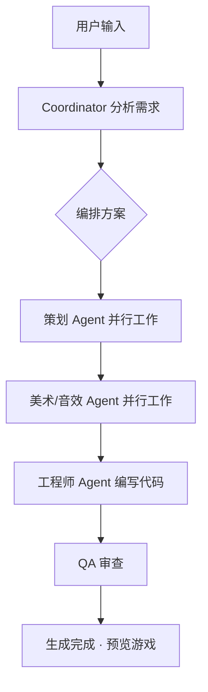

# 🎮 WeCreat — AI 游戏创作工作室

> 一句话描述你想要的游戏，AI 团队协作帮你实现。

WeCreat 是一个 **AI 驱动的游戏创作平台**，内置 22 个专业 AI Agent（策划、美术、音效、工程师、QA），通过多 Agent 协作自动完成从创意构思到可玩游戏的全流程。用户只需用自然语言描述想法，AI 团队即可自动编排、分工协作，生成完整的 HTML5 游戏。

---

## ✨ 核心特性

- **🤖 22 Agent 协作系统** — 小助手、策划、美术、音效、工程师、QA 六大分组，模拟真实游戏团队
- **⚡ 双模式创作**
  - **Quick Mode**：一句话自动生成，AI 全自动编排执行
  - **Collab Mode**：多轮深度协作，逐步确认方案后再执行
- **🎯 智能编排引擎** — Coordinator 分析需求 → 拓扑排序 → 分批并行执行 → 工程师写代码
- **📡 SSE 实时推送** — 全程流式展示 Agent 工作进度、对话、文件变更
- **📱 设备仿真预览** — 支持 iPhone / iPad / 桌面多种设备尺寸，横竖屏切换
- **🎨 AI 素材生成** — 集成 iChat 图片生成 + ElevenLabs 音效生成
- **📐 布局坐标工具** — 在预览区点击标记坐标，引用到对话精确描述 UI 布局
- **🔄 版本管理** — 保存/回滚游戏版本
- **🖼️ 成果评审区** — 策划文档、设计稿、音效素材、代码产物集中展示

---

## 🏗️ 系统架构

```
┌──────────────────┐    SSE     ┌──────────────────┐   子进程   ┌──────────────────────┐
│     前端 UI      │ ◄────────► │    Node.js       │ ────────► │   agent_runner.py    │
│   index.html     │   /api/*   │    Express       │           │   OpenAI SDK         │
│   app.js         │            │   server/        │           │   → Adams API → 模型  │
│   styles.css     │            │   index.js       │           │                      │
└──────────────────┘            └──────────────────┘           └──────────────────────┘
        │                             │
        │  iframe                     │  /preview/:id/*
        ▼                             ▼
┌──────────────────┐            ┌──────────────────┐
│   游戏预览       │            │   projects/      │
│  （设备仿真）    │            │     {id}/        │
└──────────────────┘            │     index.html   │
                                │     game.js      │
                                └──────────────────┘
```

### 技术栈

| 层级 | 技术 |
|------|------|
| 前端 | 原生 HTML + CSS + JS（无框架），Marked.js（Markdown 渲染） |
| 后端 | Node.js + Express 5，SSE 流式通信 |
| AI 调用 | Python + OpenAI SDK → Adams API → Claude 模型 |
| 模型分级 | Opus（决策）/ Sonnet（执行）/ Haiku（审查） |

---

## 🚀 快速开始

### 前置条件

- **Node.js** ≥ 18
- **Python 3** + `openai` 包
- **Claude Code Router (CCR)** 运行在 `localhost:3456`（或自行配置）
- **Adams API** 账号和 Token

### 1. 克隆项目

```bash
git clone <repo-url>
cd wecreat001
```

### 2. 配置环境变量

```bash
cp .env.example .env
```

编辑 `.env`，填写必要的配置项（参考 `.env.example` 中的注释说明）：

```env
NODE_ENV=production          # production=线上环境 / development=本地环境
PORT=3020                    # 服务端口

# Adams API（必填）
ADAMS_API_BASE_ONLINE=...   # 线上环境地址
ADAMS_API_BASE_LOCAL=...    # 本地环境地址
ADAMS_BUSINESS=...
ADAMS_USER=...
ADAMS_TOKEN=...

# Claude Code Router（必填）
ANTHROPIC_BASE_URL=http://localhost:3456
ANTHROPIC_AUTH_TOKEN=test

# 可选：音效 & 图片生成
ELEVENLABS_API_KEY=...
# ICHAT_APPID=...
# ICHAT_APPKEY=...
```

### 3. 安装依赖

```bash
cd server && npm install && cd ..
pip3 install openai
```

### 4. 启动服务

**方式一：一键启动脚本**

```bash
# 线上环境
./start.sh online

# 本地开发环境
./start.sh local

# 使用 .env 中的 NODE_ENV
./start.sh
```

**方式二：手动启动**

```bash
cd server
npm start          # 生产模式
# 或
npm run dev        # 开发模式（文件改动自动重启）
```

### 5. 访问

打开浏览器访问 `http://localhost:3020`（端口取决于 `.env` 中的 `PORT` 配置）。

---

## 🎮 使用方式

### 仿真模式

顶部栏 API 开关保持**关闭**状态。发送消息后走仿真流程 —— 模拟多 Agent 协作、逐步展示进度，不调用真实 AI。**适合 UI 演示和体验**。

### Real API 模式

打开顶部栏 **API 开关**，流程如下：

1. 前端 → `POST /api/projects` 创建项目
2. 前端 → SSE 连接后端编排接口
3. Coordinator（小助手）分析需求，制定编排方案
4. 按拓扑排序分批并行调度 Agent（策划 → 美术/音效 → 工程师）
5. 工程师在 `projects/{id}/` 目录下生成游戏文件
6. 后端通过 SSE 实时推送进度
7. 生成完成后，前端自动在预览区加载游戏

---

## 🤖 Agent 体系

### 六大分组 · 22 个 Agent

| 分组 | Agent | 职责 |
|------|-------|------|
| **小助手** | 🤖 小助手 (coordinator) | 需求分析与智能编排 |
| | 📋 制作人 (producer) | 项目管理与跨部门协调 |
| **策划** | 🎯 创意总监 (creative-director) | 游戏愿景与支柱决策 |
| | 🎮 游戏设计师 (game-designer) | 核心循环/系统/平衡 |
| | ⚙️ 系统设计师 (systems-designer) | 公式/数值/交互矩阵 |
| | 🗺️ 关卡设计师 (level-designer) | 空间/遭遇战/节奏 |
| | 📖 叙事导演 (narrative-director) | 故事/世界观/角色 |
| | 💰 经济设计师 (economy-designer) | 资源流/掉落表/进度曲线 |
| **美术** | 🎨 美术总监 (art-director) | 视觉风格/资产规格 |
| | 🖌️ 技术美术 (technical-artist) | Shader/VFX/性能优化 |
| | 🖥️ UX 设计师 (ux-designer) | 用户流/交互/可访问性 |
| **音效** | 🎵 音频总监 (audio-director) | 声音调色板/音乐方向 |
| | 🔊 音效设计师 (sound-designer) | SFX 规格表/音频事件 |
| **工程师** | 🏗️ 技术总监 (technical-director) | 架构决策/技术评估 |
| | 👨‍💻 首席程序员 (lead-programmer) | 代码架构/审查 |
| | 🕹️ 游戏程序员 (gameplay-programmer) | 功能实现 |
| | ⚡ 引擎程序员 (engine-programmer) | 核心系统 |
| | 🚀 原型师 (prototyper) | 快速验证（HTML5 主力） |
| | 🟢 Unity 专家 (unity-specialist) | Unity 项目专用 |
| | 🔵 Unreal 专家 (unreal-specialist) | UE 项目专用 |
| | 🟣 Godot 专家 (godot-specialist) | Godot 项目专用 |
| **审核** | 🧪 QA 负责人 (qa-lead) | 测试策略/Bug 分级 |

### 编排流程



---

## 📡 API 接口

### 项目管理

| 方法 | 路径 | 说明 |
|------|------|------|
| POST | `/api/projects` | 创建新项目 |
| GET | `/api/projects` | 列出所有项目 |
| DELETE | `/api/projects/:id` | 删除项目 |
| GET | `/api/projects/:id/files` | 列出项目文件 |
| GET | `/api/projects/:id/files/*` | 读取文件内容 |
| POST | `/api/projects/:id/upload` | 上传素材 |

### 生成 & 编排

| 方法 | 路径 | 说明 |
|------|------|------|
| GET | `/api/generate/:id` | SSE 单 Agent 生成 |
| GET | `/api/orchestrate/:id` | SSE Quick Mode 多 Agent 编排 |
| POST | `/api/generate/:id/stop` | 停止生成 |

### 协作会话 (Collab Mode)

| 方法 | 路径 | 说明 |
|------|------|------|
| POST | `/api/sessions/:id/start` | 启动协作会话 |
| POST | `/api/sessions/:id/respond` | 用户回复/确认方案 |
| GET | `/api/sessions/:id/state` | 获取会话状态 |
| POST | `/api/sessions/:id/agent/:agentId` | 直接与指定 Agent 对话 |
| POST | `/api/sessions/:id/phase` | 手动切换阶段 |

### 其他

| 方法 | 路径 | 说明 |
|------|------|------|
| GET | `/api/health` | 健康检查 |
| GET | `/api/agents` | 获取 Agent 注册表 |
| GET | `/preview/:id/*` | 静态文件预览 |

### SSE 事件类型

| 事件 | 说明 |
|------|------|
| `status` | 阶段状态 (starting / generating / completed) |
| `agent_message` | Agent 发言（展示在聊天区） |
| `orchestrate_phase` | 编排阶段变更 |
| `orchestrate_plan` | 编排方案（Agent 列表、任务分配） |
| `agent_summary` | Agent 产出摘要 |
| `progress` | 进度百分比 |
| `file_changed` | 文件写入通知 |
| `session_state` | 会话状态更新 |
| `log` | 日志文本 |
| `error_msg` | 错误消息 |
| `done` | 流结束 |

---

## 📁 项目结构

```
wecreat001/
├── index.html              # 前端主页面（596 行）
├── app.js                  # 前端逻辑（7000+ 行）
├── styles.css              # 样式文件
├── start.sh                # 一键启动脚本
├── .env.example            # 环境变量模板
├── .env                    # 环境变量配置（不提交）
├── .gitignore
│
├── server/                 # 后端服务
│   ├── index.js            # Express 主服务（SSE + API + 编排引擎）
│   ├── agent_runner.py     # Python Agent 执行器（OpenAI SDK → Adams API）
│   ├── asset_generator.py  # 素材生成器
│   ├── package.json        # Node.js 依赖
│   ├── agents/             # 22 个 Agent 的 System Prompt（Markdown）
│   │   ├── coordinator.md
│   │   ├── game-designer.md
│   │   ├── art-director.md
│   │   ├── prototyper.md
│   │   └── ...
│   └── scripts/
│       └── image_generator.py  # iChat 图片生成脚本
│
├── avatars/                # Agent 头像资源
├── projects/               # AI 生成的游戏项目目录（不提交）
└── demo-game/              # 演示用 Demo 游戏
```

---

## 🔧 环境说明

项目支持**线上环境**和**本地开发环境**两种模式，通过 `NODE_ENV` 区分：

| 配置项 | 线上 (production) | 本地 (development) |
|--------|-------------------|-------------------|
| Adams API | `ADAMS_API_BASE_ONLINE`（polaris 内网） | `ADAMS_API_BASE_LOCAL`（office 地址） |
| 启动命令 | `./start.sh online` | `./start.sh local` |

`ADAMS_API_BASE` 会根据 `NODE_ENV` 自动选择对应地址，也可手动覆盖。

---

## 📄 License

ISC
